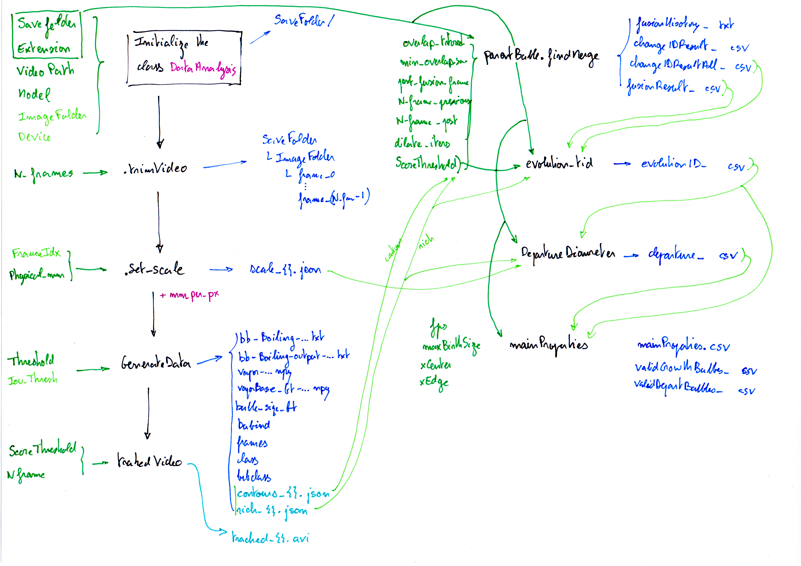

# BubbleID Project

This project aims to analyze and characterize bubble behavior from videos and images, using automatic detection, tracking, and statistical analysis tools. It relies on the Detectron2 library for detection and provides many scripts for analysis, visualization, and automation of processing.

This project is an improvement of the original BUBBLEID code developed by Dunlap et al. ([see](https://github.com/cldunlap73/BubbleID)).
It was first enhanced by Gio B. to detect bubble rising velocities and implement diameter extraction methods.
The current goal is to add new features for bubble detection, especially the tracking of coalescence history.

## Project Structure

- `Customizable/`: Main scripts for bubble analysis, detection, tracking, and visualization.
- `Inputs/`: Input data (CSV, JSON, detection results, etc.).
- `MODELS/`: Trained detection models.
- `My_output/`, `results/`: Analysis results and graphical outputs.
- `training/`: Scripts and data for model training.

## Project Diagram

## Main Scripts' Description

| File/Script                                    | Quick Description |
|------------------------------------------------|------------------|
| **BubbleID_My.py**                             | Main script for bubble identification from images/videos, using Detectron2 for detection and tracking. Code of original BubbleID modified by Gio|
| **BubbleIDTutorial.ipynb**                     | Jupyter notebook tutorial for using the BubbleID pipeline. Code of the original BubbleID|
| **bubbleProperties.py**                        | Computes and saves main bubble properties (departure diameter, growth time, frequencies, velocities) from processed CSV files. |
| **comparaisonCollapse.py**                     | Compares different bubble fusion scenarios to validate fusion detection algorithms. |
| **compPerf.py**                                | Creates detection models from images of varying quality, saves weights, and tests performance, results saved in a CSV. |
| **computedwell.py**                            | Analyzes bubble dwell times and detachment events from tracking files, generates evolution chains, and saves results. |
| **correctionLabel.py**                         | Corrects labels of attached bubbles based on their vertical position in the image. |
| **csteDef.py**                                 | Defines constants used throughout the scripts (ATTACHED, DETACHED, UNKNOWN). |
| **departureDiameter.py**                       | Computes the departure diameter of bubbles at detachment from tracking data. |
| **evolution_tid.py**                           | Analyzes the temporal evolution of bubbles (tracking), statistics on lifetime and detection. |
| **frequency.py**                               | Counts the number of “attached” → “detached” transitions to estimate bubble detachment frequency. |
| **gui.py**                                     | Graphical interface (Tkinter) to launch BubbleID analyses interactively. |
| **multipleAnalysis.py**                        | Allows automatic analysis of multiple experiments (chips and voltages) in a single run. |
| **parentBubble.py**                            | Manages detection and analysis of bubble fusions, mask construction, and parent management. |
| **performance.ipynb**                          | Jupyter notebook for performance analysis and visualization of the training |
| **plot2.py**                                   | Generates global result plots (e.g., frequency vs departure diameter, frequency vs voltage). |
| **plotBubble.py**                              | Visualizes individual bubble properties and compares different datasets. |
| **plotFvsQ.py**                                | Plots bubble frequency as a function of voltage, for different chips. |
| **plotVvsD.py**                                | Compares bubble rising velocity as a function of diameter. |
| **position.py**                                | Extracts bubble position (top, bottom, centroid) from contours and enriched data. |
| **velocities.py**                              | Computes bubble velocities and provides statistics on their movement. |
| **affichage/afficher_frames_autour.py**        | Displays a set of frames around a given frame in a video for visual inspection. |
| **affichage/side_by_side.py**                  | Creates a side-by-side (2x2 or 1x2) video montage from 2 to 4 videos, with labels. |
| **functions/richFileFunctions.py**             | Utility functions for reading and processing rich CSV files with bubble data. |
| **functions/rmmissing.py**                     | Removes NaN or None values from arrays or lists. Matlab like function|
| **functions/rmoutliers.py**                    | Removes outliers from numerical arrays or lists using various methods. Matlab like function|